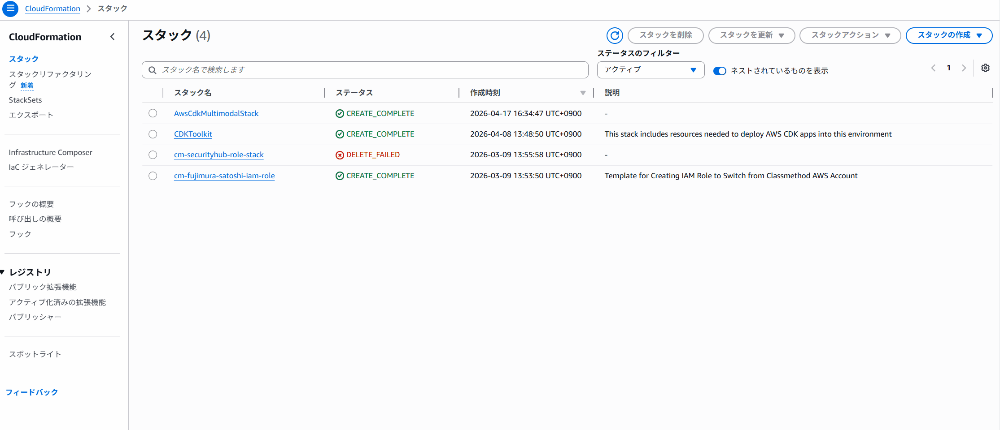
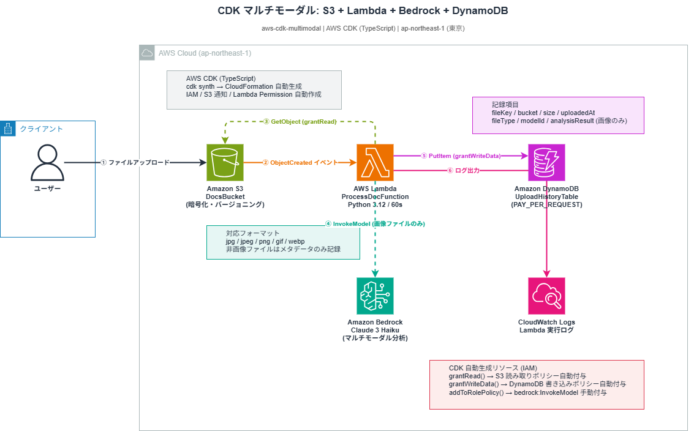
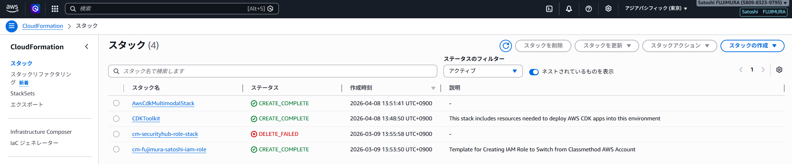
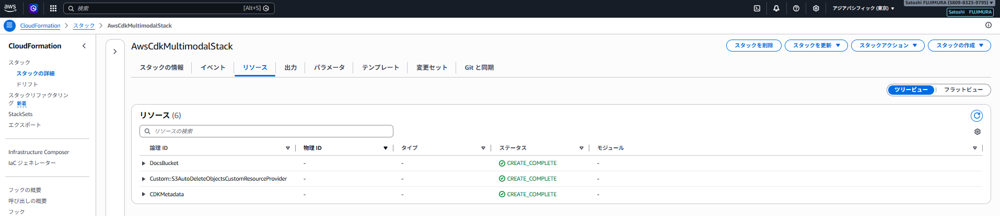
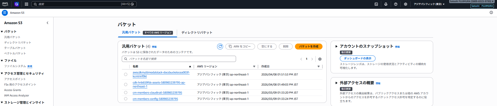
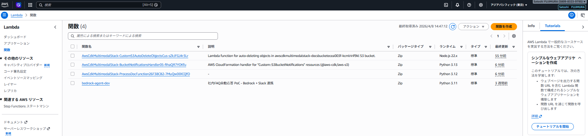
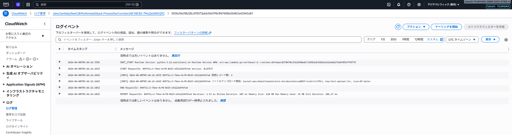
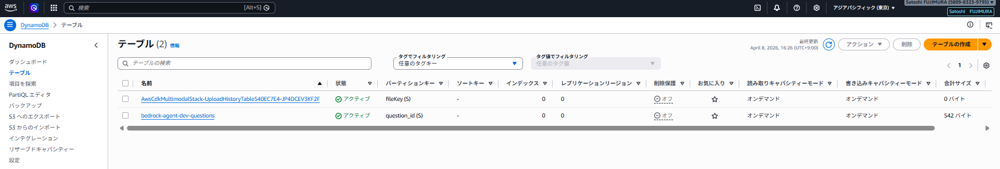
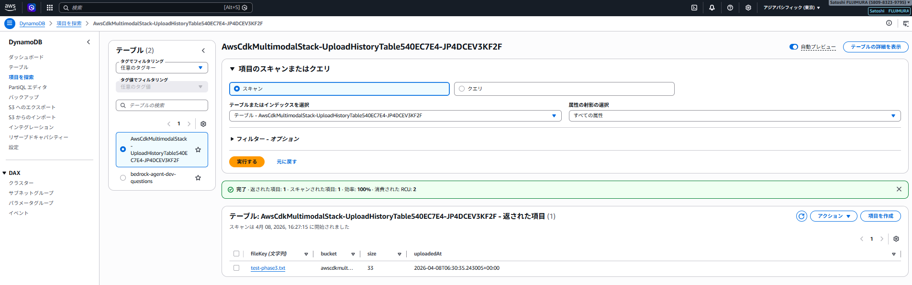
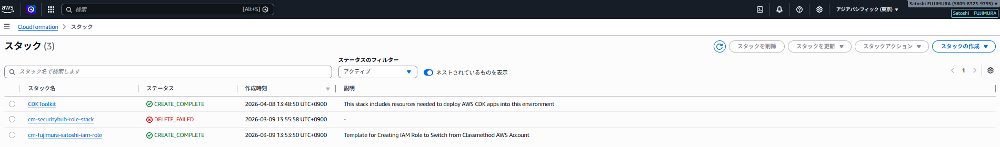

# aws-cdk-multimodal


AWS CDK（TypeScript）で S3 + Lambda + Amazon Bedrock + DynamoDB によるイベント駆動アーキテクチャを定義・デプロイする実装例です。
S3 にアップロードされた画像を Lambda が検知し、Amazon Bedrock（Claude 3 Haiku）でマルチモーダル分析して結果を DynamoDB に記録します。
Terraform との比較を意識しながら、CDK の基本的な使い方（synth / bootstrap / deploy / destroy）と高レベル抽象化（L2 Construct / grantRead / grantWriteData）を習得するためのプロジェクトです。

---

## デモ



---

## アーキテクチャ



```
CDK TypeScript コード
  ↓ cdk synth
CloudFormation テンプレート（自動生成）
  ↓ cdk deploy
S3 バケット → Lambda（S3 イベントトリガー）
  → 画像ファイル: Bedrock Claude 3 Haiku でマルチモーダル分析 → DynamoDB（分析結果記録）
  → 非画像ファイル: DynamoDB（メタデータのみ記録）
```

---

## 技術スタック

| カテゴリ | 使用技術 |
|---|---|
| IaC | AWS CDK（TypeScript） |
| ストレージ | Amazon S3（暗号化・バージョニング） |
| コンピュート | AWS Lambda（Python 3.12 / タイムアウト 60s） |
| AI / 生成 AI | Amazon Bedrock / Claude 3 Haiku（マルチモーダル画像分析） |
| データベース | Amazon DynamoDB（PAY_PER_REQUEST） |
| 監視 | Amazon CloudWatch Logs |
| 言語 | TypeScript / Python |
| リージョン | ap-northeast-1（東京） |

---

## 実装内容

### Phase 1: S3 バケット（`lib/aws-cdk-multimodal-stack.ts`）

```typescript
const docsBucket = new s3.Bucket(this, 'DocsBucket', {
  blockPublicAccess: s3.BlockPublicAccess.BLOCK_ALL,  // パブリックアクセス全ブロック
  encryption: s3.BucketEncryption.S3_MANAGED,          // AES-256 暗号化
  versioned: true,                                      // バージョニング有効
  removalPolicy: cdk.RemovalPolicy.DESTROY,            // スタック削除時にバケットも削除
  autoDeleteObjects: true,                              // 削除前にオブジェクトを自動空に
});
```

**Terraform との比較：**

| 設定 | Terraform | CDK |
|---|---|---|
| バケット作成 | `aws_s3_bucket` | `new s3.Bucket()` |
| パブリックアクセスブロック | `aws_s3_bucket_public_access_block` | `blockPublicAccess` オプション 1行 |
| 暗号化 | `aws_s3_bucket_server_side_encryption_configuration` | `encryption` オプション 1行 |
| バージョニング | `aws_s3_bucket_versioning` | `versioned: true` 1行 |
| 削除時オブジェクト削除 | 自分で Lambda + カスタムリソースを書く | `autoDeleteObjects: true` 1行（CDK が自動生成） |

### Phase 2: Lambda + S3 イベントトリガー（`lib/aws-cdk-multimodal-stack.ts`）

```typescript
// Lambda 関数定義
const processDocFn = new lambda.Function(this, 'ProcessDocFunction', {
  runtime: lambda.Runtime.PYTHON_3_12,
  handler: 'lambda_function.lambda_handler',
  code: lambda.Code.fromAsset('lambda_src/process_doc'),
  environment: { BUCKET_NAME: docsBucket.bucketName },
  timeout: cdk.Duration.seconds(30),
});

// S3 読み取り権限を自動付与（IAM ポリシーを自動生成）
docsBucket.grantRead(processDocFn);

// S3 ObjectCreated イベントで Lambda を自動起動（1行で完結）
docsBucket.addEventNotification(
  s3.EventType.OBJECT_CREATED,
  new s3n.LambdaDestination(processDocFn),
);
```

**Terraform では個別に必要なリソース → CDK では自動生成：**
- `aws_lambda_permission`（S3 が Lambda を呼び出す権限）→ 自動
- `aws_s3_bucket_notification`（S3 イベント通知設定）→ 自動
- `aws_iam_policy`（Lambda の S3 読み取り権限）→ `grantRead()` 1行

### Phase 3: DynamoDB 追加（`lib/aws-cdk-multimodal-stack.ts`）

```typescript
// DynamoDB テーブル定義
const uploadHistoryTable = new dynamodb.Table(this, 'UploadHistoryTable', {
  partitionKey: { name: 'fileKey', type: dynamodb.AttributeType.STRING },
  billingMode: dynamodb.BillingMode.PAY_PER_REQUEST, // オンデマンド
  encryption: dynamodb.TableEncryption.AWS_MANAGED,
  removalPolicy: cdk.RemovalPolicy.DESTROY,
});

// DynamoDB 書き込み権限を自動付与（IAM ポリシーを自動生成）
uploadHistoryTable.grantWriteData(processDocFn);
```

**Terraform では個別に必要 → CDK では自動生成：**
- `aws_dynamodb_table` → `new dynamodb.Table()` 1ブロックで完結
- `aws_iam_policy`（DynamoDB 書き込み権限）→ `grantWriteData()` 1行

### Phase 4: CDK テスト（`test/aws-cdk-multimodal.test.ts`）

CDK には CloudFormation テンプレートをアサートするテストフレームワーク（`aws-cdk-lib/assertions`）が組み込まれています。

```typescript
import { Template, Match } from 'aws-cdk-lib/assertions';

const template = Template.fromStack(stack);

// S3 のパブリックアクセスが全ブロックされているか
template.hasResourceProperties('AWS::S3::Bucket', {
  PublicAccessBlockConfiguration: {
    BlockPublicAcls: true,
    BlockPublicPolicy: true,
  },
});

// Lambda のタイムアウトが 60 秒か
template.hasResourceProperties('AWS::Lambda::Function', {
  Timeout: 60,
});

// Bedrock InvokeModel 権限が付与されているか
template.hasResourceProperties('AWS::IAM::Policy', {
  PolicyDocument: {
    Statement: Match.arrayWith([
      Match.objectLike({
        Action: 'bedrock:InvokeModel',
        Effect: 'Allow',
      }),
    ]),
  },
});
```

**Terraform との比較：**

| テスト手法 | Terraform | CDK |
|---|---|---|
| 静的検証 | `terraform validate` / `terraform plan` | `cdk synth` |
| ユニットテスト | Terratest（Go）/ pytest（python） | `aws-cdk-lib/assertions`（組み込み） |
| IaC コードと同言語 | No（Go/Python が必要） | Yes（TypeScript で完結） |

### Phase 5: Bedrock マルチモーダル分析（`lambda_src/process_doc/lambda_function.py`）

S3 にアップロードされた画像を Bedrock Claude 3 Haiku でマルチモーダル分析します。

```python
def analyze_image(image_base64: str, media_type: str) -> str:
    """Bedrock Claude にマルチモーダルリクエストを送り、画像分析テキストを返す。"""
    body = {
        "anthropic_version": "bedrock-2023-05-31",
        "max_tokens": 1024,
        "messages": [{
            "role": "user",
            "content": [
                {
                    "type": "image",
                    "source": {
                        "type": "base64",
                        "media_type": media_type,  # "image/png" etc.
                        "data": image_base64,
                    },
                },
                {"type": "text", "text": "この画像を詳しく分析してください..."},
            ],
        }],
    }
    response = bedrock_client.invoke_model(modelId=MODEL_ID, body=json.dumps(body))
    result = json.loads(response["body"].read())  # ※ Bedrock は小文字 "body"
    return result["content"][0]["text"]
```

**CDK スタック側の追加設定（`lib/aws-cdk-multimodal-stack.ts`）：**

```typescript
// Bedrock InvokeModel 権限（L2 Construct の grant 系メソッドは存在しないため手動付与）
processDocFn.addToRolePolicy(new iam.PolicyStatement({
  actions: ['bedrock:InvokeModel'],
  resources: [
    `arn:aws:bedrock:${this.region}::foundation-model/${MODEL_ID}`,
  ],
}));
```

**対応画像フォーマット：** jpg / jpeg / png / gif / webp
**非画像ファイル：** メタデータ（fileKey / bucket / size / uploadedAt）のみ DynamoDB に記録

| DynamoDB 属性 | 画像ファイル | 非画像ファイル |
|---|---|---|
| fileKey | ✅ | ✅ |
| bucket / size / uploadedAt | ✅ | ✅ |
| fileType | `"image"` | `"document"` |
| modelId | Claude 3 Haiku ARN | なし |
| analysisResult | Claude の分析テキスト（日本語） | なし |

---

## デプロイ手順

```bash
# 依存パッケージインストール
npm install

# CloudFormation テンプレート生成確認
aws-vault exec personal-dev-source -- cdk synth

# CDK 用リソースを AWS アカウントに準備（初回のみ）
aws-vault exec personal-dev-source -- cdk bootstrap

# デプロイ
aws-vault exec personal-dev-source -- cdk deploy
```

### 出力例

```
Outputs:
AwsCdkMultimodalStack.BucketName = awscdkmultimodalstack-docsbucketecea003f-kcmlririf9kl
```

---

## 削除手順

```bash
aws-vault exec personal-dev-source -- cdk destroy
```

---

## スクリーンショット

> Phase 1〜4 は S3 / Lambda / DynamoDB の基本構成、Phase 5 で Bedrock マルチモーダル分析を追加した状態でのデプロイ確認です。

### Phase 1: S3 バケット定義・デプロイ

#### CloudFormation スタック一覧


#### スタックリソース一覧（6リソース）


#### S3 バケット一覧


### Phase 2: Lambda + S3 イベントトリガー

#### Lambda 関数一覧
`ProcessDocFunction`（Python 3.12）が作成済み。CDK が自動生成した AutoDeleteObjects / BucketNotificationsHandler も確認できる。


#### CloudWatch Logs（S3 アップロード検知ログ）
`test-upload.txt` をアップロード後、Lambda が自動起動し `ファイルアップロード検知: key=test-upload.txt, size=49 bytes` をログ出力。


### Phase 3: DynamoDB 追加・Lambda から書き込み

#### DynamoDB テーブル一覧
`UploadHistoryTable`（パーティションキー: fileKey・オンデマンド課金）が作成済み。


#### DynamoDB 項目（アップロード履歴）
`test-phase3.txt` をアップロード後、Lambda が自動起動し fileKey / bucket / size / uploadedAt を記録。


### Phase 4: cdk destroy（リソース全削除）

#### CloudFormation スタック一覧（destroy 後）
`AwsCdkMultimodalStack` が削除され `CDKToolkit` のみ残存。S3・Lambda・DynamoDB がすべて削除された状態。


---

## 技術的なポイント・工夫

- **CDK = CloudFormation の上位抽象レイヤー**：`cdk synth` で CloudFormation テンプレートに変換される。コード変更の差分は `cdk diff` で確認できる
- **型補完の恩恵**：TypeScript の型定義により、`s3.BucketEncryption.S3_MANAGED` のように補完が効くため設定ミスを防ぎやすい
- **autoDeleteObjects の裏側**：`autoDeleteObjects: true` を指定すると CDK が自動で Lambda + Custom Resource を追加生成してくれる。Terraform では自前実装が必要な部分
- **cdk bootstrap**：CDK が CloudFormation テンプレートや Lambda コードを S3 にアップロードするための専用バケット・IAM ロール等を事前作成するコマンド。アカウント×リージョンごとに1回実行すれば以後不要
- **Construct の概念**：CDK のリソース定義単位。L1（CloudFormation 直接対応）/ L2（高レベル抽象）/ L3（パターン）の3層構造があり、`s3.Bucket` は L2 Construct
- **Bedrock マルチモーダル API の注意点**：boto3 の `bedrock-runtime` クライアントは `invoke_model()` のレスポンスキーが小文字の `"body"`（S3 の `"Body"` とは異なる）。`json.loads(response["body"].read())` と読む必要がある
- **Bedrock の IAM 権限は手動付与が必要**：`grantRead()` / `grantWriteData()` のような CDK 組み込み grant メソッドは Bedrock には存在しないため、`addToRolePolicy()` で `bedrock:InvokeModel` を明示的に付与する
- **Lambda タイムアウトを 60s に延長**：Bedrock の画像分析（大きい画像・長文回答）では 30s では不足することがある。Bedrock 呼び出しを含む Lambda は余裕を持ったタイムアウト設定が必要
- **CDK テストフレームワーク**：`aws-cdk-lib/assertions` を使うと CloudFormation テンプレートをユニットテストできる。`npx jest` で 14 テスト全件 PASS を確認済み

---

## AI 活用について

本プロジェクトは以下の Anthropic ツールを活用して開発しています。

| ツール | 用途 |
|---|---|
| **Claude Code** | インフラ設計・コード生成・デバッグ・コードレビュー。コミットまで一貫してサポート |
| **Claude Cowork** | 技術調査・設計相談・ドキュメント作成を日常的に活用。AI との協働を業務フローに組み込んでいる |
| **カスタム Skills** | Terraform / Python / AWS に特化した Skills を設定・継続的に更新。自分の技術スタックに最適化したワークフローを構築 |

> AI を「使う」だけでなく、自分の業務・技術スタックに合わせて**設定・運用・改善し続ける**ことを意識しています。

---

## 関連リポジトリ

- [aws-cdk-3tier-app](https://github.com/satoshif1977/aws-cdk-3tier-app) - CDK で VPC / ALB / EC2 / RDS の 3 層構成を実装
- [aws-eventbridge-lambda](https://github.com/satoshif1977/aws-eventbridge-lambda) - EventBridge + Lambda のスケジュール実行・S3 イベント駆動の 2 パターン（Terraform）
- [aws-bedrock-agent](https://github.com/satoshif1977/aws-bedrock-agent) - Bedrock Agent + Lambda FAQ ボット（Terraform）
