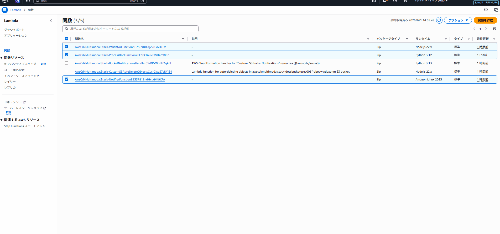
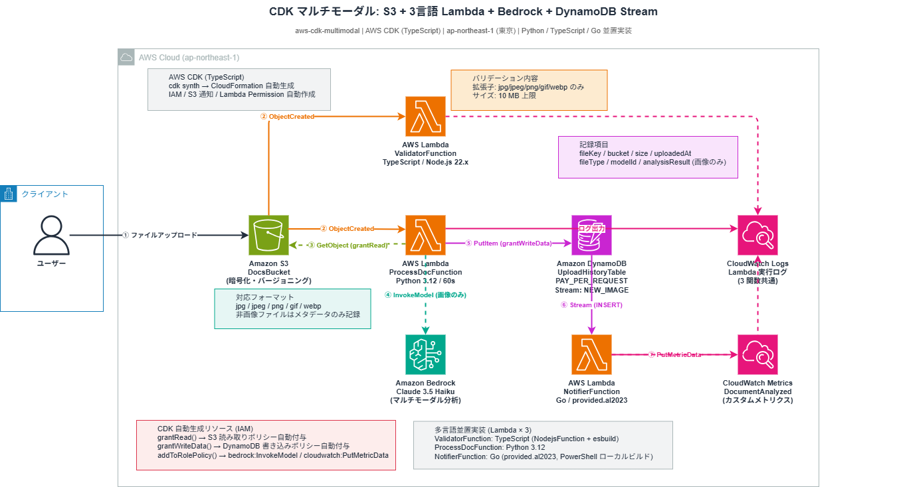
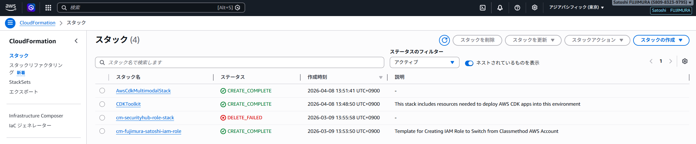
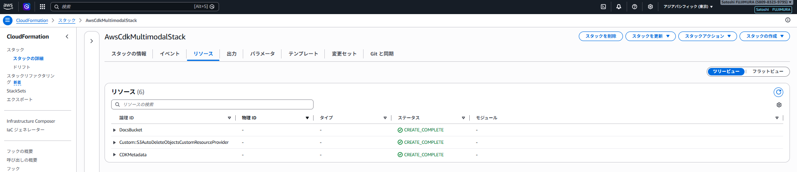
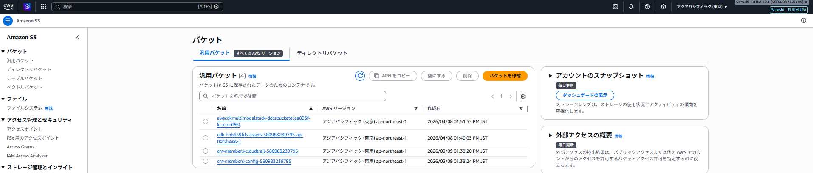
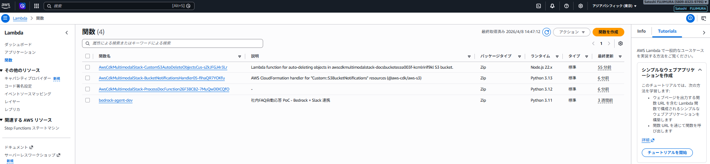
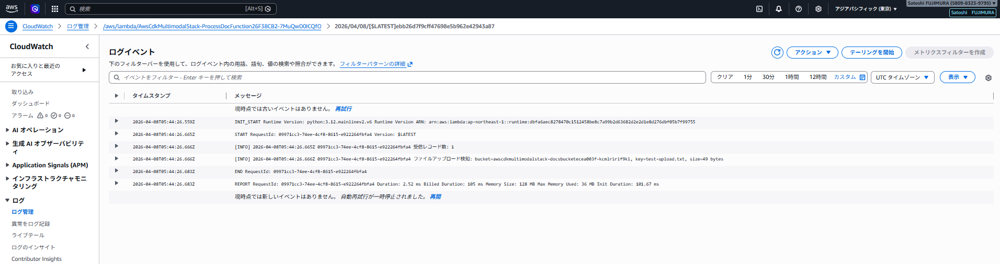
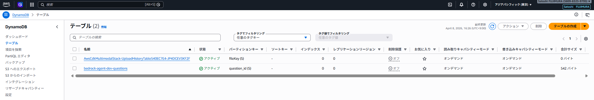
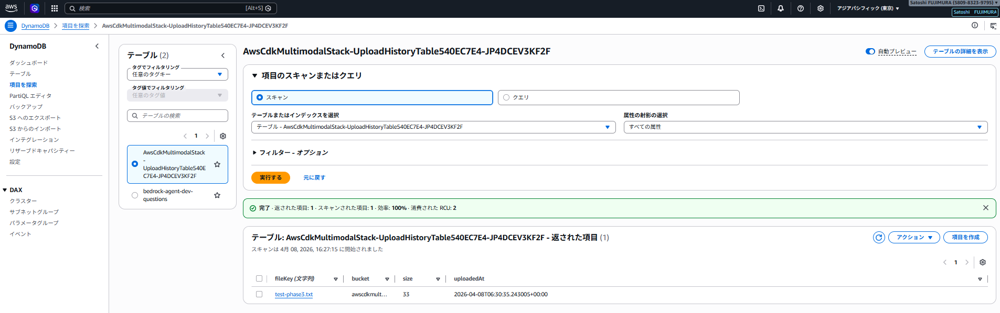
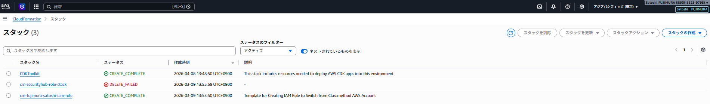

# aws-cdk-multimodal


[](https://github.com/satoshif1977/aws-cdk-multimodal/actions/workflows/go-test.yml)
[](https://github.com/satoshif1977/aws-cdk-multimodal/actions/workflows/python-test.yml)


AWS CDK（TypeScript）で S3 + 3言語 Lambda + Amazon Bedrock + DynamoDB によるイベント駆動アーキテクチャを定義・デプロイする実装例です。
S3 にアップロードされた画像を Lambda が検知し、Amazon Bedrock（Claude Haiku 4.5）でマルチモーダル分析して結果を DynamoDB に記録します。
**Python / TypeScript / Go** の 3言語 Lambda を並置実装しており、DynamoDB Stream を使ったリアルタイム通知（CloudWatch カスタムメトリクス）も含みます。
Terraform との比較を意識しながら、CDK の基本的な使い方（synth / bootstrap / deploy / destroy）と高レベル抽象化（L2 Construct / grantRead / grantWriteData / NodejsFunction / DynamoEventSource）を習得するためのプロジェクトです。

---

## デモ



---

## アーキテクチャ



```
CDK TypeScript コード
  ↓ cdk synth
CloudFormation テンプレート（自動生成）
  ↓ cdk deploy

S3 バケット ─ ObjectCreated ──→ ValidatorFunction（TypeScript / Node.js 22.x）
                                  └─ 拡張子チェック（jpg/png/gif/webp のみ）
                                  └─ サイズチェック（10 MB 上限）
             ─ ObjectCreated ──→ ProcessDocFunction（Python 3.12 / 60s）
                                  ├─ 画像ファイル: Bedrock Claude Haiku 4.5 でマルチモーダル分析
                                  │    → DynamoDB（分析結果 + メタデータ記録）
                                  └─ 非画像ファイル: DynamoDB（メタデータのみ記録）

DynamoDB Stream（NEW_IMAGE / INSERT）
  └──→ NotifierFunction（Go / provided.al2023）
         └─ CloudWatch Metrics: DocumentAnalyzed（カスタムメトリクス）
```

---

## 技術スタック

| カテゴリ | 使用技術 |
|---|---|
| IaC | AWS CDK（TypeScript） |
| ストレージ | Amazon S3（暗号化・バージョニング） |
| コンピュート | AWS Lambda（Python 3.12 / Node.js 22.x / provided.al2023）|
| AI / 生成 AI | Amazon Bedrock / Claude Haiku 4.5（マルチモーダル画像分析） |
| データベース | Amazon DynamoDB（PAY_PER_REQUEST・Stream NEW_IMAGE） |
| 監視 | Amazon CloudWatch Logs / CloudWatch カスタムメトリクス |
| 言語 | TypeScript / Python / Go |
| リージョン | ap-northeast-1（東京） |

---

## 実装内容

### Phase 1: S3 バケット（`lib/aws-cdk-multimodal-stack.ts`）

```typescript
const docsBucket = new s3.Bucket(this, 'DocsBucket', {
  blockPublicAccess: s3.BlockPublicAccess.BLOCK_ALL,  // パブリックアクセス全ブロック
  encryption: s3.BucketEncryption.S3_MANAGED,          // AES-256 暗号化
  versioned: true,                                      // バージョニング有効
  removalPolicy: cdk.RemovalPolicy.DESTROY,            // スタック削除時にバケットも削除
  autoDeleteObjects: true,                              // 削除前にオブジェクトを自動空に
});
```

**Terraform との比較：**

| 設定 | Terraform | CDK |
|---|---|---|
| バケット作成 | `aws_s3_bucket` | `new s3.Bucket()` |
| パブリックアクセスブロック | `aws_s3_bucket_public_access_block` | `blockPublicAccess` オプション 1行 |
| 暗号化 | `aws_s3_bucket_server_side_encryption_configuration` | `encryption` オプション 1行 |
| バージョニング | `aws_s3_bucket_versioning` | `versioned: true` 1行 |
| 削除時オブジェクト削除 | 自分で Lambda + カスタムリソースを書く | `autoDeleteObjects: true` 1行（CDK が自動生成） |

### Phase 2: Lambda + S3 イベントトリガー（`lib/aws-cdk-multimodal-stack.ts`）

```typescript
// Lambda 関数定義
const processDocFn = new lambda.Function(this, 'ProcessDocFunction', {
  runtime: lambda.Runtime.PYTHON_3_12,
  handler: 'lambda_function.lambda_handler',
  code: lambda.Code.fromAsset('lambda_src/process_doc'),
  environment: { BUCKET_NAME: docsBucket.bucketName },
  timeout: cdk.Duration.seconds(30),
});

// S3 読み取り権限を自動付与（IAM ポリシーを自動生成）
docsBucket.grantRead(processDocFn);

// S3 ObjectCreated イベントで Lambda を自動起動（1行で完結）
docsBucket.addEventNotification(
  s3.EventType.OBJECT_CREATED,
  new s3n.LambdaDestination(processDocFn),
);
```

**Terraform では個別に必要なリソース → CDK では自動生成：**
- `aws_lambda_permission`（S3 が Lambda を呼び出す権限）→ 自動
- `aws_s3_bucket_notification`（S3 イベント通知設定）→ 自動
- `aws_iam_policy`（Lambda の S3 読み取り権限）→ `grantRead()` 1行

### Phase 3: DynamoDB 追加（`lib/aws-cdk-multimodal-stack.ts`）

```typescript
// DynamoDB テーブル定義
const uploadHistoryTable = new dynamodb.Table(this, 'UploadHistoryTable', {
  partitionKey: { name: 'fileKey', type: dynamodb.AttributeType.STRING },
  billingMode: dynamodb.BillingMode.PAY_PER_REQUEST, // オンデマンド
  encryption: dynamodb.TableEncryption.AWS_MANAGED,
  removalPolicy: cdk.RemovalPolicy.DESTROY,
});

// DynamoDB 書き込み権限を自動付与（IAM ポリシーを自動生成）
uploadHistoryTable.grantWriteData(processDocFn);
```

**Terraform では個別に必要 → CDK では自動生成：**
- `aws_dynamodb_table` → `new dynamodb.Table()` 1ブロックで完結
- `aws_iam_policy`（DynamoDB 書き込み権限）→ `grantWriteData()` 1行

### Phase 4: CDK テスト（`test/aws-cdk-multimodal.test.ts`）

CDK には CloudFormation テンプレートをアサートするテストフレームワーク（`aws-cdk-lib/assertions`）が組み込まれています。

```typescript
import { Template, Match } from 'aws-cdk-lib/assertions';

const template = Template.fromStack(stack);

// S3 のパブリックアクセスが全ブロックされているか
template.hasResourceProperties('AWS::S3::Bucket', {
  PublicAccessBlockConfiguration: {
    BlockPublicAcls: true,
    BlockPublicPolicy: true,
  },
});

// Lambda のタイムアウトが 60 秒か
template.hasResourceProperties('AWS::Lambda::Function', {
  Timeout: 60,
});

// Bedrock InvokeModel 権限が付与されているか
template.hasResourceProperties('AWS::IAM::Policy', {
  PolicyDocument: {
    Statement: Match.arrayWith([
      Match.objectLike({
        Action: 'bedrock:InvokeModel',
        Effect: 'Allow',
      }),
    ]),
  },
});
```

**Terraform との比較：**

| テスト手法 | Terraform | CDK |
|---|---|---|
| 静的検証 | `terraform validate` / `terraform plan` | `cdk synth` |
| ユニットテスト | Terratest（Go）/ pytest（python） | `aws-cdk-lib/assertions`（組み込み） |
| IaC コードと同言語 | No（Go/Python が必要） | Yes（TypeScript で完結） |

### Phase 5: Bedrock マルチモーダル分析（`lambda_src/process_doc/lambda_function.py`）

S3 にアップロードされた画像を Bedrock Claude Haiku 4.5 でマルチモーダル分析します。

```python
def analyze_image(image_base64: str, media_type: str) -> str:
    """Bedrock Claude にマルチモーダルリクエストを送り、画像分析テキストを返す。"""
    body = {
        "anthropic_version": "bedrock-2023-05-31",
        "max_tokens": 1024,
        "messages": [{
            "role": "user",
            "content": [
                {
                    "type": "image",
                    "source": {
                        "type": "base64",
                        "media_type": media_type,  # "image/png" etc.
                        "data": image_base64,
                    },
                },
                {"type": "text", "text": "この画像を詳しく分析してください..."},
            ],
        }],
    }
    response = bedrock_client.invoke_model(modelId=MODEL_ID, body=json.dumps(body))
    result = json.loads(response["body"].read())  # ※ Bedrock は小文字 "body"
    return result["content"][0]["text"]
```

**CDK スタック側の追加設定（`lib/aws-cdk-multimodal-stack.ts`）：**

```typescript
// Bedrock InvokeModel 権限（L2 Construct の grant 系メソッドは存在しないため手動付与）
processDocFn.addToRolePolicy(new iam.PolicyStatement({
  actions: ['bedrock:InvokeModel'],
  resources: [
    `arn:aws:bedrock:${this.region}::foundation-model/${MODEL_ID}`,
  ],
}));
```

**対応画像フォーマット：** jpg / jpeg / png / gif / webp
**非画像ファイル：** メタデータ（fileKey / bucket / size / uploadedAt）のみ DynamoDB に記録

### サポートフォーマット詳細

| 拡張子 | MIME タイプ | 処理 | 備考 |
|---|---|---|---|
| `.jpg` / `.jpeg` | `image/jpeg` | Bedrock マルチモーダル分析 | 最も一般的な写真フォーマット |
| `.png` | `image/png` | Bedrock マルチモーダル分析 | スクリーンショット・図表に最適 |
| `.gif` | `image/gif` | Bedrock マルチモーダル分析 | 静止画として分析（アニメーション非対応） |
| `.webp` | `image/webp` | Bedrock マルチモーダル分析 | Web 最適化フォーマット |
| 上記以外 | — | メタデータのみ DynamoDB 記録 | PDF・テキスト・動画等 |

**制限事項:**
- 最大ファイルサイズ: 5 MB 以下推奨（Bedrock API の base64 エンコード制限）
- Lambda タイムアウト: 60 秒（大きな画像の分析で超過する場合はファイルを縮小）
- Bedrock の画像サイズ上限: 短辺 200px 以上・長辺 4096px 以下推奨

| DynamoDB 属性 | 画像ファイル | 非画像ファイル |
|---|---|---|
| fileKey | ✅ | ✅ |
| bucket / size / uploadedAt | ✅ | ✅ |
| fileType | `"image"` | `"document"` |
| modelId | Claude Haiku 4.5 ARN | なし |
| analysisResult | Claude の分析テキスト（日本語） | なし |

### Phase 6: TypeScript Lambda バリデーター（`lambda_src/validator/index.ts`）

S3 ObjectCreated イベントを受け取り、**拡張子チェック・ファイルサイズ上限チェック**を行う TypeScript Lambda です。
`NodejsFunction` + esbuild で CDK がバンドリングします。

```typescript
const ALLOWED_EXTENSIONS = new Set(['.jpg', '.jpeg', '.png', '.gif', '.webp']);
const MAX_SIZE_BYTES = 10 * 1024 * 1024; // 10 MB

export function validateRecord(record: S3EventRecord): ValidationResult {
  const fileKey = decodeURIComponent(record.s3.object.key.replace(/\+/g, ' '));
  const sizeBytes = record.s3.object.size;
  const ext = fileKey.slice(fileKey.lastIndexOf('.')).toLowerCase();

  if (!ALLOWED_EXTENSIONS.has(ext)) {
    return { valid: false, fileKey, reason: `unsupported extension: ${ext}` };
  }
  if (sizeBytes > MAX_SIZE_BYTES) {
    return { valid: false, fileKey, reason: `size ${sizeBytes} exceeds limit ${MAX_SIZE_BYTES}` };
  }
  return { valid: true, fileKey };
}
```

**CDK スタック側の定義（`lib/aws-cdk-multimodal-stack.ts`）：**

```typescript
const validatorFn = new lambdaNodejs.NodejsFunction(this, 'ValidatorFunction', {
  entry: 'lambda_src/validator/index.ts',
  handler: 'handler',
  runtime: lambda.Runtime.NODEJS_22_X,
  bundling: { minify: true, sourceMap: false },
});
docsBucket.addEventNotification(s3.EventType.OBJECT_CREATED, new s3n.LambdaDestination(validatorFn));
```

- `NodejsFunction` は esbuild でバンドリング・トランスパイルを自動化（`tsc` 不要）
- 純粋関数 `validateRecord()` を export することで Jest ユニットテストが書きやすい（7 テスト）

### Phase 7: Go Lambda ノティファイアー（`lambda_src/notifier/main.go`）

DynamoDB Stream（INSERT イベント）を受け取り、**CloudWatch カスタムメトリクス `DocumentAnalyzed`** を送信する Go Lambda です。

```go
func ProcessRecords(ctx context.Context, event events.DynamoDBEvent) (int, error) {
    var published int
    for _, record := range event.Records {
        if record.EventName != "INSERT" { continue }
        _, err := cwClient.PutMetricData(ctx, &cloudwatch.PutMetricDataInput{
            Namespace: aws.String(namespace()),
            MetricData: []types.MetricDatum{{
                MetricName: aws.String("DocumentAnalyzed"),
                Value:      aws.Float64(1),
                Unit:       types.StandardUnitCount,
            }},
        })
        if err != nil { return published, err }
        published++
    }
    return published, nil
}
```

**CDK スタック側の定義（`lib/aws-cdk-multimodal-stack.ts`）：**

```typescript
const notifierFn = new lambda.Function(this, 'NotifierFunction', {
  runtime: lambda.Runtime.PROVIDED_AL2023,
  handler: 'bootstrap',
  code: lambda.Code.fromAsset('lambda_src/notifier', {
    bundling: {
      image: lambda.Runtime.PROVIDED_AL2023.bundlingImage,
      local: {
        tryBundle(outputDir: string): boolean {
          // Windows: PowerShell でクロスコンパイル
          execSync(
            `powershell -Command "$env:GOARCH='amd64'; $env:GOOS='linux'; ` +
            `Push-Location '${srcDir}'; go build -o '${outputDir}/bootstrap' .; Pop-Location"`,
          );
          return true;
        },
      },
    },
  }),
});
uploadHistoryTable.grantStreamRead(notifierFn);
notifierFn.addEventSource(new lambdaEventSources.DynamoEventSource(uploadHistoryTable, {
  startingPosition: lambda.StartingPosition.TRIM_HORIZON,
}));
notifierFn.addToRolePolicy(new iam.PolicyStatement({
  actions: ['cloudwatch:PutMetricData'],
  resources: ['*'],
}));
```

- Windows 環境では `GOARCH=amd64 GOOS=linux` が cmd/bash で通らないため PowerShell `$env:` 構文で対応
- DynamoDB Stream は `StreamViewType.NEW_IMAGE` を有効化し、`DynamoEventSource` でバインド（4 テスト）

---

## デプロイ手順

```bash
# 依存パッケージインストール
npm install

# CloudFormation テンプレート生成確認
aws-vault exec personal-dev-source -- cdk synth

# CDK 用リソースを AWS アカウントに準備（初回のみ）
aws-vault exec personal-dev-source -- cdk bootstrap

# デプロイ
aws-vault exec personal-dev-source -- cdk deploy
```

### 出力例

```
Outputs:
AwsCdkMultimodalStack.BucketName = awscdkmultimodalstack-docsbucketecea003f-kcmlririf9kl
```

---

## 削除手順

```bash
aws-vault exec personal-dev-source -- cdk destroy
```

---

## スクリーンショット

> Phase 1〜4 は S3 / Lambda / DynamoDB の基本構成、Phase 5 で Bedrock マルチモーダル分析を追加した状態でのデプロイ確認です。

### Phase 1: S3 バケット定義・デプロイ

#### CloudFormation スタック一覧


#### スタックリソース一覧（6リソース）


#### S3 バケット一覧


### Phase 2: Lambda + S3 イベントトリガー

#### Lambda 関数一覧
`ProcessDocFunction`（Python 3.12）が作成済み。CDK が自動生成した AutoDeleteObjects / BucketNotificationsHandler も確認できる。


#### CloudWatch Logs（S3 アップロード検知ログ）
`test-upload.txt` をアップロード後、Lambda が自動起動し `ファイルアップロード検知: key=test-upload.txt, size=49 bytes` をログ出力。


### Phase 3: DynamoDB 追加・Lambda から書き込み

#### DynamoDB テーブル一覧
`UploadHistoryTable`（パーティションキー: fileKey・オンデマンド課金）が作成済み。


#### DynamoDB 項目（アップロード履歴）
`test-phase3.txt` をアップロード後、Lambda が自動起動し fileKey / bucket / size / uploadedAt を記録。


### Phase 4: cdk destroy（リソース全削除）

#### CloudFormation スタック一覧（destroy 後）
`AwsCdkMultimodalStack` が削除され `CDKToolkit` のみ残存。S3・Lambda・DynamoDB がすべて削除された状態。


---

## 技術的なポイント・工夫

- **CDK = CloudFormation の上位抽象レイヤー**：`cdk synth` で CloudFormation テンプレートに変換される。コード変更の差分は `cdk diff` で確認できる
- **型補完の恩恵**：TypeScript の型定義により、`s3.BucketEncryption.S3_MANAGED` のように補完が効くため設定ミスを防ぎやすい
- **autoDeleteObjects の裏側**：`autoDeleteObjects: true` を指定すると CDK が自動で Lambda + Custom Resource を追加生成してくれる。Terraform では自前実装が必要な部分
- **cdk bootstrap**：CDK が CloudFormation テンプレートや Lambda コードを S3 にアップロードするための専用バケット・IAM ロール等を事前作成するコマンド。アカウント×リージョンごとに1回実行すれば以後不要
- **Construct の概念**：CDK のリソース定義単位。L1（CloudFormation 直接対応）/ L2（高レベル抽象）/ L3（パターン）の3層構造があり、`s3.Bucket` は L2 Construct
- **Bedrock マルチモーダル API の注意点**：boto3 の `bedrock-runtime` クライアントは `invoke_model()` のレスポンスキーが小文字の `"body"`（S3 の `"Body"` とは異なる）。`json.loads(response["body"].read())` と読む必要がある
- **Bedrock の IAM 権限は手動付与が必要**：`grantRead()` / `grantWriteData()` のような CDK 組み込み grant メソッドは Bedrock には存在しないため、`addToRolePolicy()` で `bedrock:InvokeModel` を明示的に付与する
- **Lambda タイムアウトを 60s に延長**：Bedrock の画像分析（大きい画像・長文回答）では 30s では不足することがある。Bedrock 呼び出しを含む Lambda は余裕を持ったタイムアウト設定が必要
- **3言語 Lambda の並置実装**：Python（`lambda.Function + fromAsset`）/ TypeScript（`NodejsFunction + esbuild`）/ Go（`PROVIDED_AL2023 + ローカルビルド`）を同一 CDK スタックで管理。言語ごとのランタイム・ビルド戦略の違いを体感できる
- **`NodejsFunction` の esbuild バンドリング**：TypeScript Lambda を個別に `tsc` でコンパイルしなくてよい。`entry` にソースファイルを指定するだけで CDK が esbuild を呼び出してバンドル・トランスパイルする
- **Go Lambda のクロスコンパイル（Windows）**：`GOARCH=amd64 GOOS=linux go build` は Windows の cmd/bash では動かない。`tryBundle` 内で `process.platform === 'win32'` を判定し、PowerShell の `$env:GOARCH='amd64'` 構文に切り替えることで解決
- **DynamoDB Stream + `DynamoEventSource`**：テーブルに `stream: StreamViewType.NEW_IMAGE` を追加し、`new DynamoEventSource(table, { startingPosition: TRIM_HORIZON })` を Lambda に addEventSource するだけでストリーム連携が完結
- **CDK テストフレームワーク**：`aws-cdk-lib/assertions` を使うと CloudFormation テンプレートをユニットテストできる。`npx jest` で 29 テスト全件 PASS を確認済み（CDK Assertions 22件 + TypeScript validator 7件）

---

## トラブルシューティング

| 症状 | 原因 | 対処法 |
|---|---|---|
| `cdk deploy` で `ECRRepositoryNotFound` | `cdk bootstrap` 未実行 | `aws-vault exec <profile> -- cdk bootstrap` を先に実行 |
| S3 アップロード後に Lambda が起動しない | `autoDeleteObjects` の Custom Resource が S3 通知を上書き | `cdk deploy` を再実行すると解決することが多い |
| Bedrock で `AccessDeniedException` | Lambda IAM ロールに `bedrock:InvokeModel` がない | `cdk synth` で生成した CloudFormation テンプレートの IAM ポリシーを確認 |
| DynamoDB に分析結果が書き込まれない | 画像フォーマットが非対応 | 対応フォーマット（jpg/jpeg/png/gif/webp）のファイルをアップロードする |
| Lambda タイムアウト | 大きな画像の Bedrock 処理が 60 秒を超えた | ファイルサイズを 5MB 以下に縮小して再試行 |
| Go ビルドが Windows で失敗 | `GOARCH=amd64` が cmd/bash で認識されない | `tryBundle` に `process.platform === 'win32'` 分岐を追加し PowerShell `$env:` 構文を使用 |
| DynamoDB Stream が Lambda をトリガーしない | Stream が無効 or `DynamoEventSource` 未設定 | テーブルに `stream: StreamViewType.NEW_IMAGE`・`notifierFn.addEventSource(new DynamoEventSource(...))` を確認 |

---

## ローカル開発・テスト方法

### ユニットテスト（デプロイ不要・約 5 秒）

```bash
npm install
npx jest
# CDK Assertions 22件 + TypeScript validator 7件 = 計 29 件を検証
```

### CDK 構成確認

```bash
aws-vault exec personal-dev-source -- npx cdk synth
# CloudFormation テンプレートを生成して確認
```

### Lambda コードのローカル確認

```bash
cd lambda_src/process_doc
python -c "
# 画像フォーマット判定ロジックの確認
ext = 'test.png'.split('.')[-1].lower()
print('is image:', ext in ['jpg', 'jpeg', 'png', 'gif', 'webp'])
"
```

---

## CI / 自動検証

GitHub Actions で TypeScript ビルド・CDK 構成検証・ユニットテストを自動実行しています。

| ジョブ | 内容 |
|---|---|
| TypeScript ビルド | 型チェック・コンパイルエラーの検出（`npm run build`） |
| CDK list | スタック構成の確認（アカウント固有ルックアップなしで実行） |
| ユニットテスト | CDK Assertions 22件 + TypeScript validator 7件 = 計 29 件をローカル検証（`npx jest`） |

> CI は `CDK_DEFAULT_ACCOUNT: '123456789012'`（ダミー値）で動作。`cdk synth` はアカウント固有のルックアップが必要なため CI では `cdk list` で代替。

---

## 学習で気づいたこと・躓いたポイント

### CDK の挙動

- **`autoDeleteObjects: true` で CDK が勝手にリソースを追加する**: このオプションを指定すると CDK が自動で「オブジェクト自動削除用 Lambda + Custom Resource」を裏で追加生成する。`cdk synth` の出力を見ると書いていないリソースが増えていて最初は驚く。CDK の「便利さの裏側」を体感できた。
- **`cdk bootstrap` を忘れると謎のエラーが出る**: CDK が内部で使う S3 バケットや IAM ロールを事前に作成するコマンド。初回に必ず必要だが、忘れると `ECRRepositoryNotFound` など直感しにくいエラーが出る。アカウント×リージョンごとに 1 回だけ実行。

### Bedrock × CDK

- **Bedrock には CDK の `grant` 系メソッドがない**: `docsBucket.grantRead(fn)` のような便利メソッドが Bedrock には存在しない。`fn.addToRolePolicy(new iam.PolicyStatement({...}))` で手動付与が必要。S3・DynamoDB と同じ感覚でいると詰まる。
- **`response["body"].read()` は小文字**: `bedrock-runtime` の `invoke_model()` レスポンスのキーは小文字の `"body"`。S3 の `response["Body"].read()`（大文字）と逆なので混同して `KeyError` が出やすい。

### TypeScript

- **型補完のおかげでミスが格段に減る**: `s3.BucketEncryption.S3_MANAGED` など設定値を補完で選べるため、Terraform の HCL で文字列をタイポするミスが起きにくい。IDE（VSCode）との相性が CDK の大きな強み。

### 多言語 Lambda × CDK

- **`NodejsFunction` は TypeScript をそのまま渡せる**: esbuild バンドラーが組み込まれているので、`entry: 'lambda_src/validator/index.ts'` と書くだけ。別途 tsc を実行したり dist フォルダを管理する必要がない。
- **Go Lambda の Windows クロスコンパイルで詰まった**: `GOARCH=amd64 GOOS=linux go build` は Linux/Mac では動くが Windows cmd/bash では認識されない。`tryBundle` の中で `process.platform === 'win32'` を判定して PowerShell 構文に切り替える必要があった。Docker がない環境でもローカルバンドリングが実現できた。
- **DynamoDB Stream は 1行追加するだけ**: `stream: StreamViewType.NEW_IMAGE` をテーブル定義に追加し、`addEventSource` で Lambda に紐づける。Terraform では `aws_dynamodb_table`・`aws_lambda_event_source_mapping` を別々に書く必要があるが、CDK では数行で完結する。

---

## AI 活用について

本プロジェクトは以下の Anthropic ツールを活用して開発しています。

| ツール | 用途 |
|---|---|
| **Claude Code** | インフラ設計・コード生成・デバッグ・コードレビュー。コミットまで一貫してサポート |
| **Claude Cowork** | 技術調査・設計相談・ドキュメント作成を日常的に活用。AI との協働を業務フローに組み込んでいる |
| **カスタム Skills** | Terraform / Python / AWS に特化した Skills を設定・継続的に更新。自分の技術スタックに最適化したワークフローを構築 |

> AI を「使う」だけでなく、自分の業務・技術スタックに合わせて**設定・運用・改善し続ける**ことを意識しています。

---

## 関連リポジトリ

- [aws-cdk-3tier-app](https://github.com/satoshif1977/aws-cdk-3tier-app) - CDK で VPC / ALB / EC2 / RDS の 3 層構成を実装
- [aws-eventbridge-lambda](https://github.com/satoshif1977/aws-eventbridge-lambda) - EventBridge + Lambda のスケジュール実行・S3 イベント駆動の 2 パターン（Terraform）
- [aws-bedrock-agent](https://github.com/satoshif1977/aws-bedrock-agent) - Bedrock Agent + Lambda FAQ ボット（Terraform）

## Security

See [SECURITY.md](SECURITY.md) for vulnerability reporting and security policies.
